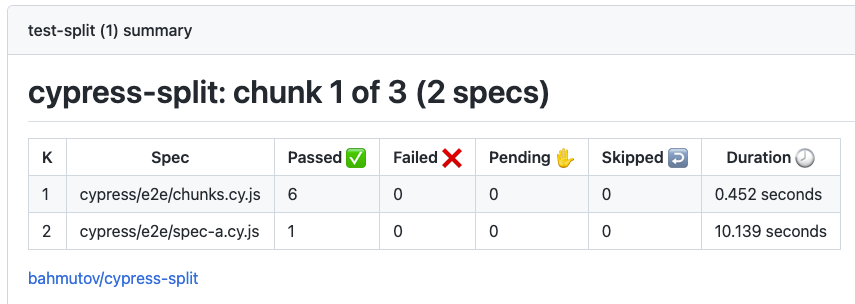
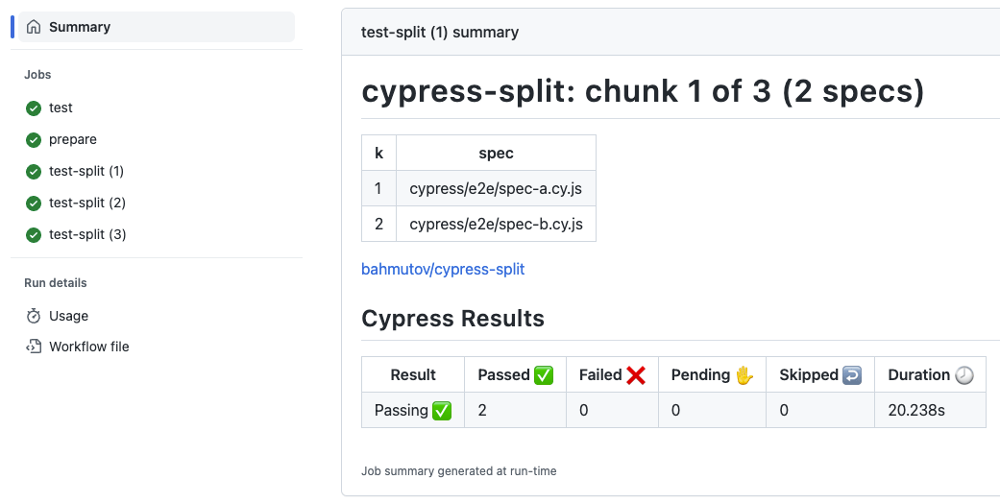
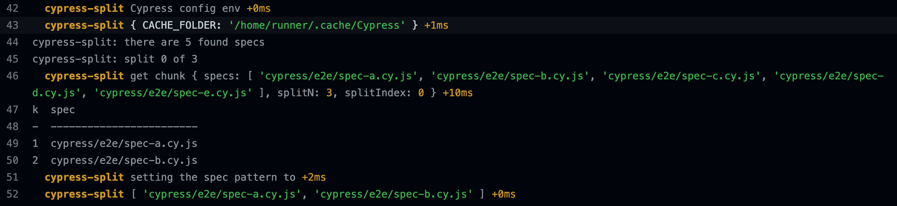

# cypress-split [](https://github.com/bahmutov/cypress-split/actions/workflows/ci.yml) [](https://dl.circleci.com/status-badge/redirect/gh/bahmutov/cypress-split/tree/main) 

> Split Cypress specs across parallel CI machines for speed
> without using any external services



- 🎓 Fully covered in my course [Cypress-split Plugin](https://cypress.tips/courses/cypress-split)
  - [Lesson a1: Run spec files in parallel using GitHub Actions](https://cypress.tips/courses/cypress-split/lessons/a1)
  - [Lesson a2: Run Cypress specs in parallel on CircleCI](https://cypress.tips/courses/cypress-split/lessons/a2)
  - [Lesson a3: Run specs in parallel on GitLab CI](https://cypress.tips/courses/cypress-split/lessons/a3)
  - [Lesson a4: Very simple GitHub Actions setup with reusable workflow](https://cypress.tips/courses/cypress-split/lessons/a4)
  - [Lesson a5: Split tests on BitBucket pipeline](https://cypress.tips/courses/cypress-split/lessons/a5)
  - [Lesson a6: Split tests on Azure DevOps](https://cypress.tips/courses/cypress-split/lessons/a6)
  - [Lesson a7: Split tests on AWS CodeBuild](https://cypress.tips/courses/cypress-split/lessons/a7)
  - [Lesson b1: Preview the split specs](https://cypress.tips/courses/cypress-split/lessons/b1)
  - [Lesson b2: Example splitting specs using GitHub Actions](https://cypress.tips/courses/cypress-split/lessons/b2)
  - [Lesson b3: Use the "split" reusable workflow](https://cypress.tips/courses/cypress-split/lessons/b3)
  - [Lesson b4: Run Cucumber specs in parallel](https://cypress.tips/courses/cypress-split/lessons/b4)
  - [Lesson b5: Run tests in parallel against several servers](https://cypress.tips/courses/cypress-split/lessons/b5)
  - [Lesson b6: Split specs from one subfolder](https://cypress.tips/courses/cypress-split/lessons/b6)
  - [Lesson b7: Split across 2 dimensions](https://cypress.tips/courses/cypress-split/lessons/b7)
  - [Lesson b8: Split across N dimensions](https://cypress.tips/courses/cypress-split/lessons/b8)
- 🎓 Partially covered in my course [Cypress Plugins](https://cypress.tips/courses/cypress-plugins)
  - [Lesson m1: Run spec files in parallel using GitHub Actions](https://cypress.tips/courses/cypress-plugins/lessons/m1)
  - [Lesson m2: Run Cypress specs in parallel on CircleCI](https://cypress.tips/courses/cypress-plugins/lessons/m2)
  - [Lesson m3: Run specs in parallel on GitLab CI](https://cypress.tips/courses/cypress-plugins/lessons/m3)
  - [Lesson m4: Very simple GitHub Actions setup with reusable workflow](https://cypress.tips/courses/cypress-plugins/lessons/m4)
  - [Lesson m5: Split tests on BitBucket pipeline](https://cypress.tips/courses/cypress-plugins/lessons/m5)
  - [Lesson m6: Split tests on Azure DevOps](https://cypress.tips/courses/cypress-plugins/lessons/m6)
- 🎓 Covered in my course [Testing The Swag Store](https://cypress.tips/courses/swag-store)
  - [Lesson 65: Speed up CI by splitting the specs](https://cypress.tips/courses/swag-store/lessons/lesson65)
  - [Bonus 29: Combine the code coverage from split E2E test jobs](https://cypress.tips/courses/swag-store/lessons/bonus29)
  - [Bonus 30: Split the component specs](https://cypress.tips/courses/swag-store/lessons/bonus30)
  - [Bonus 31: A single workflow with combined code coverage](https://cypress.tips/courses/swag-store/lessons/bonus31)

## Blog posts

- 📝 [Run Cypress Specs In Parallel For Free](https://glebbahmutov.com/blog/cypress-parallel-free/)
- 📝 [Split React Native Web Component Tests For Free](https://glebbahmutov.com/blog/split-react-native-component-tests/)
- 📝 [Full Code Coverage For Free](https://glebbahmutov.com/blog/full-cy-code-coverage/)
- 📝 [Cypress GitHub Actions Slash Command](https://glebbahmutov.com/blog/cypress-slash-command/)
- 📝 [Run Cypress Specs In Parallel For Free Using Spec Timings](https://glebbahmutov.com/blog/cypress-parallel-free-based-on-timings/)
- 📝 [Quickly Run The Changed Specs on GitHub Actions](https://glebbahmutov.com/blog/quick-changed-specs/)

## Videos

- 📺 Watch presentation [Fast Testing Using Cypress For Free 💸💸💸](https://youtu.be/1idlr9IE0oU) and see its [slides](https://slides.com/bahmutov/fast-testing-using-cypress-for-free)
- [Cut Cypress Execution In Half By Running Tests In Parallel Using cypress-split And GitHub Actions](https://youtu.be/jvBzNs0pRXU)

## Install

Add this plugin as a dev dependency and include in your Cypress config file.

```
# install using NPM
$ npm i -D cypress-split
# install using Yarn
$ yarn add -D cypress-split
```

Call this plugin from your Cypress config object `setupNodeEvents` method:

```js
// cypress.config.js
const { defineConfig } = require('cypress')
// https://github.com/bahmutov/cypress-split
const cypressSplit = require('cypress-split')

module.exports = defineConfig({
  e2e: {
    setupNodeEvents(on, config) {
      cypressSplit(on, config)
      // IMPORTANT: return the config object
      return config
    },
  },
})
```

⚠️⚠️⚠️⚠️⚠️⚠️⚠️⚠️⚠️⚠️⚠️⚠️⚠️⚠️⚠️⚠️⚠️⚠️⚠️⚠️⚠️⚠️⚠️⚠️⚠️⚠️⚠️⚠️⚠️⚠️⚠️⚠️⚠️⚠️⚠️⚠️⚠️⚠️⚠️⚠️⚠️⚠️⚠️⚠️⚠️⚠️⚠️⚠️⚠️⚠️⚠️⚠️⚠️⚠️⚠️⚠️⚠️⚠️⚠️⚠️⚠️⚠️⚠️⚠️⚠️⚠️⚠️⚠️⚠️⚠️⚠️⚠️⚠️⚠️⚠️⚠️⚠️⚠️⚠️
**Important:** return the `config` object from the `setupNodeEvents` function. Otherwise, Cypress will run all specs.
⚠️⚠️⚠️⚠️⚠️⚠️⚠️⚠️⚠️⚠️⚠️⚠️⚠️⚠️⚠️⚠️⚠️⚠️⚠️⚠️⚠️⚠️⚠️⚠️⚠️⚠️⚠️⚠️⚠️⚠️⚠️⚠️⚠️⚠️⚠️⚠️⚠️⚠️⚠️⚠️⚠️⚠️⚠️⚠️⚠️⚠️⚠️⚠️⚠️⚠️⚠️⚠️⚠️⚠️⚠️⚠️⚠️⚠️⚠️⚠️⚠️⚠️⚠️⚠️⚠️⚠️⚠️⚠️⚠️⚠️⚠️⚠️⚠️⚠️⚠️⚠️⚠️⚠️⚠️

### Cypress versions before v10

```js
// cypress/plugins/index.js
// https://github.com/bahmutov/cypress-split
const cypressSplit = require('cypress-split')

module.exports = (on, config) => {
  cypressSplit(on, config)
  // IMPORTANT: return the config object
  return config
}
```

Now update your CI script:

### GitLab CI

Run several containers and start Cypress using `--env split=true` parameter

```yml
stages:
  - build
  - test

install:
  image: cypress/base:16.14.2-slim
  stage: build
  script:
    - npm ci

test:
  image: cypress/base:16.14.2-slim
  stage: test
  parallel: 3
  script:
    - npx cypress run --env split=true
```

All specs will be split into 3 groups automatically. For caching details, see the full example in [gitlab.com/bahmutov/cypress-split-gitlab-example](https://gitlab.com/bahmutov/cypress-split-gitlab-example).

### CircleCI

```yml
parallelism: 3
command: npx cypress run --env split=true
```

See the full example in [bahmutov/cypress-split-example](https://github.com/bahmutov/cypress-split-example)

### Buildkit

```yml
npx cypress run --env split=true
```

The script uses `BUILDKITE_PARALLEL_JOB_COUNT` and `BUILDKITE_PARALLEL_JOB` environment variables.

### GitHub Actions

```yml
# run 3 copies of the current job in parallel
strategy:
  fail-fast: false
  matrix:
    containers: [1, 2, 3]
steps:
  - name: Run split Cypress tests 🧪
    uses: cypress-io/github-action@v6
    # pass the machine index and the total number
    env:
      SPLIT: ${{ strategy.job-total }}
      SPLIT_INDEX: ${{ strategy.job-index }}
```



Note that we need to pass the `SPLIT` and `SPLIT_INDEX` numbers from the `strategy` context to the plugin to grab. See the full example in [bahmutov/cypress-split-example](https://github.com/bahmutov/cypress-split-example)

### Jenkins

Sample Jenkins File to run scripts on parallel:

```groovy
pipeline {
  agent {
    // this image provides everything needed to run Cypress
    docker {
      image 'cypress/base'
    }
  }

  stages {
    // first stage installs node dependencies and Cypress binary
    stage('build') {
      steps {
        // there a few default environment variables on Jenkins
        // on local Jenkins machine (assuming port 8080) see
        // http://localhost:8080/pipeline-syntax/globals#env
        echo "Running build ${env.BUILD_ID} on ${env.JENKINS_URL}"
        sh 'npm ci'
        sh 'npm run cy:verify'
      }
    }

    stage('start local server') {
      steps {
        // start local server in the background
        // we will shut it down in "post" command block
        sh 'nohup npm run start &'
      }
    }

    // this stage runs end-to-end tests, and each agent uses the workspace
    // from the previous stage
    stage('cypress parallel tests') {
      environment {
        // Because parallel steps share the workspace they might race to delete
        // screenshots and videos folders. Tell Cypress not to delete these folders
        CYPRESS_trashAssetsBeforeRuns = 'false'
      }

      // https://jenkins.io/doc/book/pipeline/syntax/#parallel
      parallel {
        // start several test jobs in parallel, and they all
        // will use Cypress Split to load balance any found spec files
        stage('set A') {
          steps {
            echo "Running build ${env.BUILD_ID}"
            sh "npx cypress run --env split=2,splitIndex=0"
          }
        }

        // second thread runs the same command
        stage('set B') {
          steps {
            echo "Running build ${env.BUILD_ID}"
            sh "npx cypress run --env split=2,splitIndex=1"
          }
        }
      }
    }
  }

  post {
    // shutdown the server running in the background
    always {
      echo 'Stopping local server'
      sh 'pkill -f http-server'
    }
  }
}
```

### Other CIs

If you are running N containers in parallel, pass the zero-based index and the total number to the plugin using the environment variables `SPLIT_INDEX` and `SPLIT` or via [Cypress env option](https://on.cypress.io/environment-variables):

```
# using process OS environment variables
job1: SPLIT=3 SPLIT_INDEX=0 npx cypress run
job2: SPLIT=3 SPLIT_INDEX=1 npx cypress run
job3: SPLIT=3 SPLIT_INDEX=2 npx cypress run

# using Cypress env option
job1: npx cypress run --env split=3,splitIndex=0
job2: npx cypress run --env split=3,splitIndex=1
job3: npx cypress run --env split=3,splitIndex=2
```

### Index starts at 1

Some CIs provide an agent index that already starts at 1. You can pass it via `SPLIT_INDEX1` instead of `SPLIT_INDEX`

```
job1: SPLIT=3 SPLIT_INDEX1=1 npx cypress run
```

## Split specs based on timings

If you know the spec timings, you can create a JSON file and pass the timings to this plugin. The list of specs will be split into N machines to make the total durations for each machine approximately equal. You can see an example [timings.json](./timings.json) file:

```json
{
  "durations": [
    {
      "spec": "cypress/e2e/chunks.cy.js",
      "duration": 300
    },
    {
      "spec": "cypress/e2e/spec-a.cy.js",
      "duration": 10050
    },
    ...
  ]
}
```

You can pass the JSON filename via `SPLIT_FILE` environment variable or Cypress`env` variable.

```
# split all specs across 3 machines using known spec timings
# loaded from "timings.json" file
$ SPLIT_FILE=timings.json SPLIT=3 npx cypress run

# the equivalent syntax using Cypress --env argument
$ npx cypress run --env split=3,splitFile=timings.json
```

For specs not in the timings file, it will use average duration of the known specs. The timings file might not exist, in this case the specs are split by name. At the end of the run, the duration of all run specs is printed and can be saved into the timings JSON file. **Note:** you would need to combine the timings from different runners into a single JSON file yourself.

If the timings file does not exist yet, the timings will be written into the file after the run finishes. If the file exists, and the new timings have new entries or the existing entries are off by more than 10% duration, the merged file is written back. Timing for specs without any passes tests or with failed tests is ignored. You can control the threshold to avoid changing the timings file if the times are too close. For example, to only update the timings file if any duration is different by 20% you can use the environment variable `SPLIT_TIME_THRESHOLD`

```
$ SPLIT_TIME_THRESHOLD=0.2 SPLIT_FILE=... npx cypress run ...
```

See example [bahmutov/cypress-split-timings-example](https://github.com/bahmutov/cypress-split-timings-example).

**Note 2:** during Cypress execution, the working directory is set to the folder with the Cypress config file. This module tries its best to find the split file by searching the parent folders to the Git repo or root folder.

## Adjust the specs

Typically you want to find all specs and split them into chunks. But you can adjust the final list of specs using your own callback function.

```js
// the specs is the list of specs
// determined by the split algorithm
function adjustTheSpecs(specs) {
  // for example, reverse the order of specs
  specs.reveres()
  return specs
}

module.exports = defineConfig({
  e2e: {
    setupNodeEvents(on, config) {
      cypressSplit(on, config, adjustTheSpecs)
      // IMPORTANT: return the config object
      return config
    },
  },
})
```

Using your own callback function you can insert new specs to run at the beginning or run the specs in certain custom order, etc. Make sure the returned value is an array of absolute spec paths.

## Preview

You can see how this plugin is going to split the specs using the `cypress-split-preview` alias

```
# show the split across N machines
$ npx cypress-split-preview --split <N>
# show the split across N machines based on spec timings
$ npx cypress-split-preview --split <N> --split-file <JSON filename>
```

## Merging timings files

This module includes a bin utility to merge multiple timings files into one. Example:

```
npx cypress-split-merge \
  --parent-folder partials/ \
  --split-file timings.json \
  --output out-timings.json \
  --set-gha-output merged-timing
```

The above command finds all `timings.json` file in the sub folders of `partials/` folder and merges them. It saved the result to `out-timings.json` file and if running on GitHub Actions sets the job output named `merged-timing` to a stringified single line JSON line.

## Write Timings to a Separate File

You can also indicate where the plugin should output the timings, by setting the `SPLIT_OUTPUT_FILE` environment variable or the corresponding Cypress `env` variable. This will specify the file where the timings will be written. If `SPLIT_OUTPUT_FILE` is not set, the plugin will default to using the same file specified in `SPLIT_FILE`.

```
# Set the SPLIT_OUTPUT_FILE environment variable
$ SPLIT_FILE=timings.json SPLIT_OUTPUT_FILE=output.json npx cypress run

# Or use the Cypress --env option
$ npx cypress run --env splitFile=timings.json,splitOutputFile=output.json
```

## CI summary

To skip GitHub Actions summary, set an environment variable `SPLIT_SUMMARY=false`. By default, this plugin generates the summary.

## Split component specs

Works the same way as splitting E2E specs. Add this plugin to the `setupNodeEvents` callback in the `component` object in the config. See [cypress.config.js](./cypress.config.js) for example:

```js
// cypress.config.js
const { defineConfig } = require('cypress')
const cypressSplit = require('cypress-split')

module.exports = defineConfig({
  e2e: {
    // baseUrl, etc
  },

  component: {
    devServer: {
      framework: 'react',
      bundler: 'vite',
    },
    specPattern: 'components/*.cy.js',
    setupNodeEvents(on, config) {
      cypressSplit(on, config)
      // IMPORTANT: return the config object
      return config
    },
  },
})
```

Described in the blog post [Split React Native Web Component Tests For Free](https://glebbahmutov.com/blog/split-react-native-component-tests/).

## How does it work

This plugin finds the Cypress specs using [find-cypress-specs](https://github.com/bahmutov/find-cypress-specs) and then splits the list into chunks using the machine index and the total number of machines. On some CIs (GitLab, Circle), the machine index and the total number of machines are available in the environment variables. On other CIs, you have to be explicit and pass these numbers yourself.

```js
// it works something like this:
setupNodeEvents(on, config) {
  const allSpecs = findCypressSpecs()
  // allSpecs is a list of specs
  const chunk = getChunk(allSpecs, k, n)
  // chunk is a subset of specs for this machine "k" of "n"
  // set the list as the spec pattern
  // for Cypress to run
  config.specPattern = chunk
  return config
}
```

## List of specs

Suppose you want to run some specs first, for example [just the changed specs](https://glebbahmutov.com/blog/trace-changed-specs/). You would compute the list of specs and then call Cypress `run` command with the `--spec` parameter

```
$ npx cypress run --spec "spec1,spec2,spec3"
```

You can still split the specs across several machines using `cypress-split`, just move the `--spec` list (or duplicate it) to a process or Cypress env variable `spec`:

```
# using process environment variables split all specs across 2 machines
$ SPEC="spec1,spec2,spec3" SPLIT=2 SPLIT_INDEX=0 npx cypress run --spec "spec1,spec2,spec3"
$ SPEC="spec1,spec2,spec3" SPLIT=2 SPLIT_INDEX=1 npx cypress run --spec "spec1,spec2,spec3"

# using Cypress "env" option
$ npx cypress run --env split=2,splitIndex=0,spec="spec1,spec2,spec3"
$ npx cypress run --env split=2,splitIndex=1,spec="spec1,spec2,spec3"

# for CIs with automatically index detection
$ npx cypress run --env split=true,spec="spec1,spec2,spec3"
```

Inside the `SPEC=....` value you can use wildcards, for example to run all specs inside a subfolder

```
$ SPEC="cypress/e2e/featureA/*.cy.js" npx cypress run --spec "cypress/e2e/featureA/*.cy.js"
```

**Important:** if you are passing the list of specs using `--env spec="..."` and get the error `Cannot parse as valid JSON`, switch to using `SPEC` environment variable, see [#79](https://github.com/bahmutov/cypress-split/issues/79).

```
# instead of
$ npx cypress run --env spec="..." --spec "..."
Cannot parse as valid JSON

# use
$ SPEC=... npx cypress run --spec "..."
```

### Skip specs

You can pass a list of specs to _exclude_ before splitting up across the machines.

```
SKIP_SPEC="spec1,spec2" SPLIT=2 ...
# finds the list of specs and removes "spec1" and "spec2"
# before dividing across two machines
```

### Wildcards

If your `spec` pattern includes wildcards `*` then they will be resolved using `globby` module.

```
# split all specs inside the `cypress/e2e` folder
SPEC="cypress/e2e/**/*.cy.js" npx cypress run --spec "cypress/e2e/**/*.cy.js"
# or the equivalent using --env parameter
npx cypress run --spec "cypress/e2e/**/*.cy.js" --env spec="cypress/e2e/**/*.cy.js"
```

## Random shuffle

You can shuffle the found specs before splitting using a stable seed

```
$ SPLIT_RANDOM_SEED=42 npx cypress run ...
```

This is useful to randomize the order of specs to find any dependencies between the tests.

**Note:** all parallel machines usually compute the list of specs, thus the seed must be the same to guarantee the same list is generated and split correctly, otherwise some specs would be "lost".

## Relative specs output

If `cypress-split` has `SPLIT` and the index and finds the specs, it sets the list of specs in the `config` object

```js
setupNodeEvents(on, config) {
  cypressSplit(on, config)
  // config.specPattern is a string[]
  // of absolute filenames
  return config
}
```

Some situations require relative spec names, for example in Angular component specs. You can transform the specs into relative form yourself before returning the config:

```js
setupNodeEvents(on, config) {
  cypressSplit(on, config)
  if (Array.isArray(config.specPattern)) {
    // change the absolute filenames to relative
    config.specPattern = config.specPattern.map((file) => {
      return file.replace(process.cwd(), '.')
    })
  }
  return config
}
```

## Cucumber feature specs

Should work just the same, see the tested example in [bahmutov/cypress-split-cucumber-example](https://github.com/bahmutov/cypress-split-cucumber-example)

```js
// cypress.config.js
const { defineConfig } = require('cypress')
// https://github.com/bahmutov/cypress-split
const cypressSplit = require('cypress-split')
const cucumber = require('cypress-cucumber-preprocessor').default

module.exports = defineConfig({
  e2e: {
    setupNodeEvents(on, config) {
      cypressSplit(on, config)

      on('file:preprocessor', cucumber())
      // IMPORTANT: return the config object
      return config
    },
    specPattern: 'cypress/e2e/**/*.feature',
  },
})
```

## Debugging

To see diagnostic log messages from this plugin, set the environment variable `DEBUG=cypress-split`. It will give you all information necessary to understand what specs the plugin finds and how it splits them up. Here is an example debug output:



**Tip:** `cypress-split` uses [find-cypress-specs](https://github.com/bahmutov/find-cypress-specs) to discover specs. If something is wrong, it is useful to see debug messages from both modules:

```
DEBUG=cypress-split,find-cypress-specs npx cypress run
```

for example, if using GitHub Actions:

```yml
- name: Run split Cypress tests 🧪
  uses: cypress-io/github-action@v6
  # pass the machine index and the total number
  env:
    SPLIT: ${{ strategy.job-total }}
    SPLIT_INDEX: ${{ strategy.job-index }}
    DEBUG: 'cypress-split,find-cypress-specs'
```

If you notice that the plugin is not working as expected, and you are registering multiple Cypress plugins, you might be experiencing Cypress issue [#22428](https://github.com/cypress-io/cypress/issues/22428). Use [cypress-on-fix](https://github.com/bahmutov/cypress-on-fix) to register the plugins:

```js
const { defineConfig } = require('cypress')

module.exports = defineConfig({
  e2e: {
    // baseUrl, etc
    supportFile: false,
    fixturesFolder: false,
    setupNodeEvents(cypressOn, config) {
      const on = require('cypress-on-fix')(cypressOn)
      // use "on" to register plugins, for example
      // https://github.com/bahmutov/cypress-split
      require('cypress-split')(on, config)
      // https://github.com/bahmutov/cypress-watch-and-reload
      require('cypress-watch-and-reload/plugins')(on, config)
      // https://github.com/bahmutov/cypress-code-coverage
      require('@bahmutov/cypress-code-coverage/plugin')(on, config)

      // IMPORTANT: return the config object
      return config
    },
  },
})
```

## TypeScript

Types are in [src/types.d.ts](./src/types.d.ts) file. You should be able to import the config function in your TS config file.

```ts
import { defineConfig } from 'cypress'
import cypressSplit from 'cypress-split'

module.exports = defineConfig({
  e2e: {
    // baseUrl, etc
    supportFile: false,
    fixturesFolder: false,
    setupNodeEvents(on, config) {
      cypressSplit(on, config)
      // IMPORTANT: return the config object
      return config
    },
  },
})
```

### Multiple plugins

If you are using many Cypress plugins (for example my plugins covered in the [Cypress Plugins](https://cypress.tips/courses/cypress-plugins) course), you might notice that only the last plugin really works. This is due to a bug, and you can work around it using [cypress-on-fix](https://github.com/bahmutov/cypress-on-fix).

## Your specPattern list

If you set your own specs via `config.specPattern`, just do it before using the plugin to split them.

```js
setupNodeEvents(on, config) {
  // user sets their own custom specPattern list of specs
  // make sure the list of specs is relative to the folder
  // with the Cypress config file!
  config.specPattern = [
    '../cypress/e2e/spec-c.cy.js',
    '../cypress/e2e/spec-d.cy.js',
    '../cypress/e2e/spec-e.cy.js',
  ]
  cypressSplit(on, config)
  // IMPORTANT: return the config object
  return config
},
```

## Small print

Author: Gleb Bahmutov &lt;gleb.bahmutov@gmail.com&gt; &copy; 2023

- [@bahmutov](https://twitter.com/bahmutov)
- [glebbahmutov.com](https://glebbahmutov.com)
- [blog](https://glebbahmutov.com/blog)
- [videos](https://www.youtube.com/glebbahmutov)
- [presentations](https://slides.com/bahmutov)
- [cypress.tips](https://cypress.tips)
- [Cypress Tips & Tricks Newsletter](https://cypresstips.substack.com/)
- [my Cypress courses](https://cypress.tips/courses)

License: MIT - do anything with the code, but don't blame me if it does not work.

Support: if you find a problem, open an issue in this repository. Consider [sponsoring my open-source work](https://github.com/sponsors/bahmutov).
